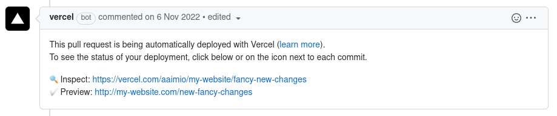

# Overview

**Capture a Vercel preview URL and feed it into your next GitHub action.**




1. Runs when an edit is made to a pull request comment (see
   [example](https://github.com/aaimio/vercel-preview-url-action#example)
   below).
   - Wish to capture the preview URL on `push` or `pull_request`? Check out
     [zentered/vercel-preview-url](https://github.com/zentered/vercel-preview-url)
2. Checks whether the editor of the comment is Vercel's bot account on GitHub.
3. Attempts to extract the preview URL from the comment and sets it as the
   action's output so you can forward it your next action.

**Notes**

- This action only succeeds when a preview URL was found, it either gets
  cancelled if `GITHUB_TOKEN` is passed or fails if the token is not passed.
- This action keeps executing for every edit (if following
  `issue_comment.edited` trigger). When a new commit is pushed, Vercel may edit
  the comment again, triggering this action. Ensure you're building in logic
  into your next action to handle this.

## Inputs

| Name                 | Description                                                                                                                             |
| -------------------- | --------------------------------------------------------------------------------------------------------------------------------------- |
| `cancel_on_strings`  | Cancel the action when any of these (comma separated) strings appear in the edited comment.                                             |
| `GITHUB_TOKEN`       | Pass this (as `${{secrets.GITHUB_TOKEN}}`) to cancel actions instead of failing them.                                                   |
| `preview_url_regexp` | Regular expression pattern (without delimiters!) to capture the preview URL. Ensure one of the capture groups captures the preview URL. |
| `vercel_bot_name`    | The name of the Vercel account commenting on pull requests. (default: `vercel[bot]`)                                                    |

## Outputs

| Name                 | Description                                                                                                                                                                                            |
| -------------------- | ------------------------------------------------------------------------------------------------------------------------------------------------------------------------------------------------------ |
| `vercel_preview_url` | The preview URL which can be accessed through the [`steps` context](https://docs.github.com/en/free-pro-team@latest/actions/reference/context-and-expression-syntax-for-github-actions#steps-context). |

## Example

The example below captures the Vercel preview URL and comments with it on the
pull request.

```YML
name: Capture Vercel preview URL

on:
  issue_comment:
    types: [edited]

jobs:
  capture_vercel_preview_url:
    name: Capture Vercel preview URL
    runs-on: "ubuntu-latest"
    steps:
      - uses: aaimio/vercel-preview-url-action@v2.0.3
        id: vercel_preview_url
        with:
          GITHUB_TOKEN: ${{ secrets.GITHUB_TOKEN }}
      # Below is but an example of what you could do with the preview URL.
      # The preview URL is accessed through ${{ steps.<step_id>.outputs.vercel_preview_url }}
      - uses: actions/github-script@v3
        with:
          github-token: ${{secrets.GITHUB_TOKEN}}
          script: |
            github.issues.createComment({
              issue_number: context.issue.number,
              owner: context.repo.owner,
              repo: context.repo.repo,
              body: 'The preview URL is: ${{ steps.vercel_preview_url.outputs.vercel_preview_url }}.'
            });
```

## Example use cases

- [Automated Lighthouse metrics to your PR with Vercel and GitHub
  Actions](https://github.com/OskarAhl/Lighthouse-github-action-comment)
